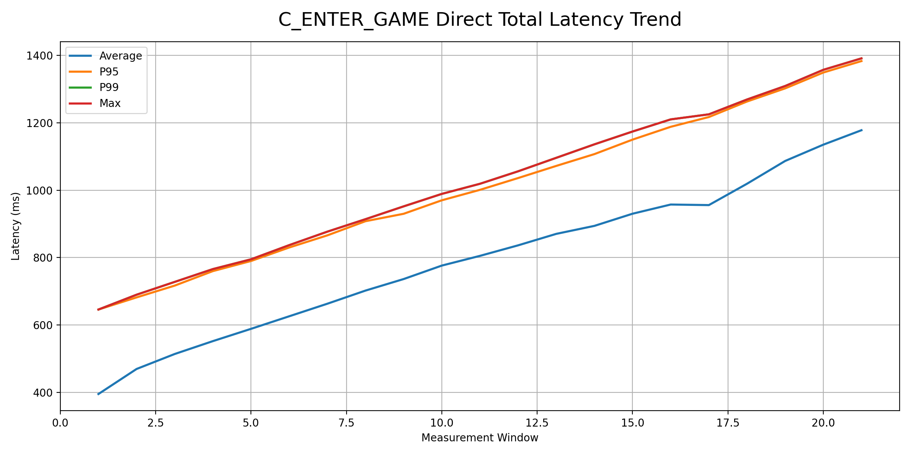
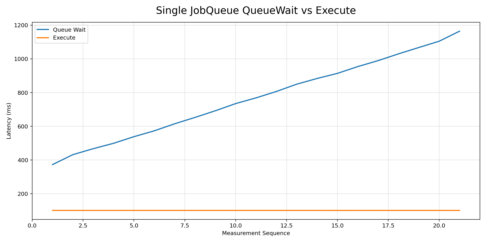
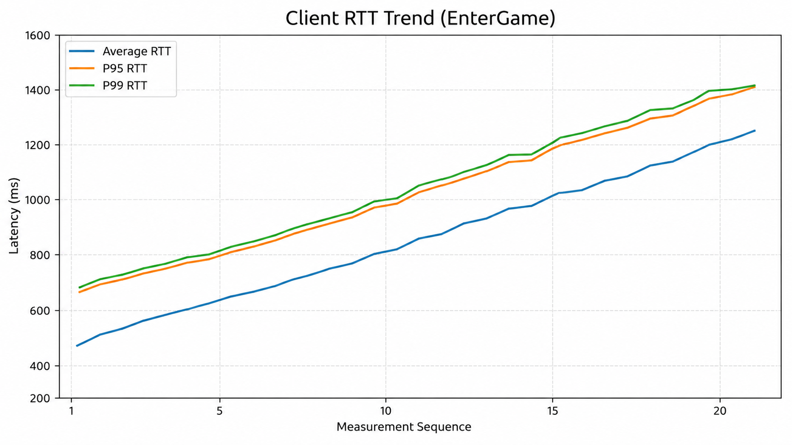
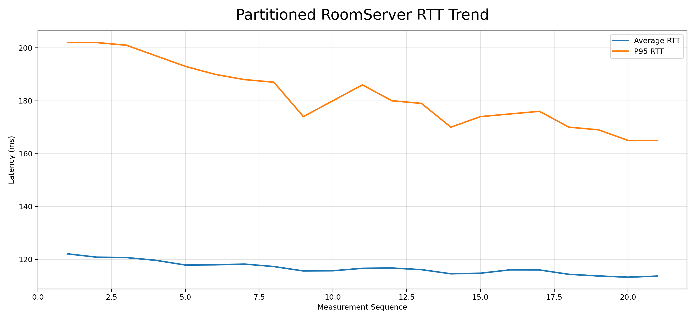
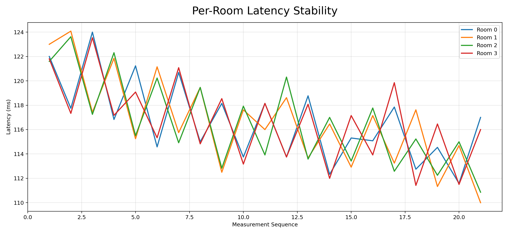
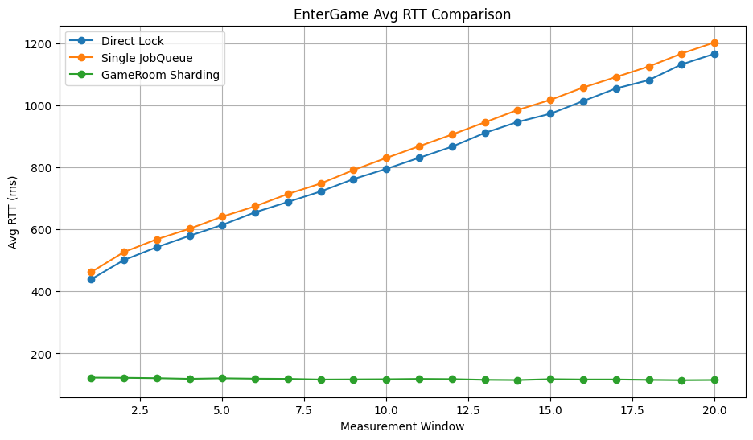
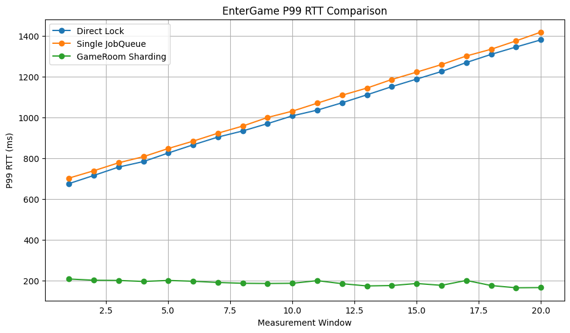

# Scenario 1 — EnterGame 동시성

동시에 많은 플레이어가 EnterGame 요청을 보낼 경우 발생하는  
동시성 문제와 Queue 병목을 재현하고,  
Ownership 기반 구조로 개선한 시나리오입니다.

---

# Goal

다음 문제를 재현하고 개선하는 것을 목표로 했습니다.

- Shared State 동시 접근
- Lock Contention
- Queue Throughput Bottleneck
- Tail Latency 증가
- Single Queue 병목

또한 Avg뿐 아니라 P95 / P99 latency를 함께 측정해  
실제 서버 환경에서 발생하는 Tail Latency 문제를 확인했습니다.

---

# Test Environment

| Category           | Value                       |
| ------------------ | --------------------------- |
| Runtime            | .NET 10                     |
| Protocol           | TCP                         |
| Serialization      | Protobuf                    |
| Client             | DummyClient                 |
| Concurrent Clients | 1000                        |
| Metrics            | RTT / QueueWait / P95 / P99 |

---

# EnterGame Flow

## EnterGame Ownership Evolution


---
# Problem

1000개의 클라이언트가 동시에 EnterGame 요청을 보낼 경우,
여러 스레드가 동시에 `ObjectManager` 내부 Shared State(`Player Dictionary`) 에 접근했다.

동기화 없이 처리할 경우 **Race Condition** 이 발생하였고,
이를 해결하기 위해 **다양한 동시성 처리 구조를 적용**했다.

```csharp
private Dictionary<int, Player> _players = new();

public void Add()
{
	_players.Add(playerId, player);
}
```

---

# Step 1 — Direct Lock

## Structure

EnterGame 요청이 왔을 때,
`ObjectManager`의 `Player Dictionary` 접근을 [Direct Lock 기반](https://github.com/junsugi/ServerSkills/blob/98a7835e3c45e549484b0975e9fdbfdbb3965b01/Server/Object/ObjectManager.cs#L19-L31)으로 처리했다.

```csharp
// ObjectManager.cs
public class ObjectManager 
{
	public void Add()
	{
		lock (_lock)
		{
		    _players.Add(playerId, player);
		    Thread.Sleep(100); // 테스트용 병목
		}
	}
}
```

---
## Result

- 정합성은 보장됨.
- 하지만 동시 접근 수가 증가하면서 공유자원에 대한 경합이 심화되었다.
### Observed Problems

- Lock Contention 증가
- Lock Wait 증가
- Queue Backlog 증가
- P95 / P99 RTT 증가
- RTT 증가

---
## Metrics

| Phase          | Avg RTT |   P95 |   P99 |
| -------------- | ------: | ----: | ----: |
| Initial Load   |   395ms | 646ms | 646ms |
| Mid Load       |   552ms | 760ms | 766ms |
| Sustained Load |   588ms | 790ms | 795ms |

---


부하가 전반적으로 누적되면서 Avg RTT가 점진적으로 증가했다.

특히 Sustained Load 상황에서 Tail Latency(P95/P99)가 함께 증가하며,  
전반적인 Queue Backlog 누적 현상을 확인할 수 있었다.

Latency 또한 지속적으로 증가했으며,
**최악의 경우 1391ms까지** RTT가 증가하는 현상을 확인할 수 있었다.

---
# Step 2 — Single JobQueue

## Structure

Shared State 접근을 [Single JobQueue Ownership](https://github.com/junsugi/ServerSkills/blob/98a7835e3c45e549484b0975e9fdbfdbb3965b01/Server/Object/ObjectManager.cs#L38-L54)으로 변경했다.

```csharp
// ObjectManager.cs
// JobSerializer 클래스는 직접 구현
public class ObjectManager : JobSerializer
{
	public void AddQueue()
	{
		Push(() =>
		{
		    _players.Add(playerId, player);
		    Thread.Sleep(100);  // 테스트용 병목
		});
	}
}
```

`ObjectManager` 내부 상태는 JobQueue에서만 수정하도록 변경했다.

---

## Result

- Lock Contention 감소
- Shared State Ownership 명확화
- Thread-Safe 보장

하지만 모든 요청이 하나의 Queue에서 순차적으로 처리되면서  
**단일 Queue 처리 병목**이 발생했다.

---
## Observed Problems

- Queue Wait 증가
- Queue Backlog 누적
- RTT Tail Latency 증가

---

## Metrics

| Phase          | QueueWait Avg | Execute Avg | ResponseTotal Avg |    P95 |    P99 |    Max |
| -------------- | ------------: | ----------: | ----------------: | -----: | -----: | -----: |
| Initial Load   |         372ms |       100ms |             473ms |  696ms |  707ms |  707ms |
| Mid Load       |         614ms |       100ms |             715ms |  917ms |  923ms |  923ms |
| High Load      |         850ms |       100ms |             951ms | 1144ms | 1151ms | 1151ms |
| Sustained Load |        1105ms |       100ms |            1206ms | 1409ms | 1417ms | 1417ms |
| Peak           |        1164ms |       100ms |            1265ms | 1422ms | 1422ms | 1422ms |

---


Execute 시간은 약 100ms 수준으로 비교적 일정하게 유지되었지만,  
부하가 누적될수록 QueueWait이 지속적으로 증가했다.  
  
이는 단일 JobQueue의 처리 속도보다 요청 유입 속도가 더 빨라지며,  
Queue Backlog가 점진적으로 누적되었음을 의미한다.



클라이언트 기준 RTT 또한 지속적으로 증가하는 현상을 확인할 수 있었다.

서버 내부 **Queue Wait 증가가 누적**되면서 요청 처리 이전 대기 시간이 증가하였고,
그 결과 **클라이언트가 체감하는 End-to-End Latency 또한 함께 증가**했다.

---

# Step 3 — GameRoom Sharding

## Structure

기존에는 하나의 공유 영역에서 모든 플레이어 상태를 처리했다면, 이 단계에서는 [Room 단위로 Ownership을 분리](https://github.com/junsugi/ServerSkills/blob/98a7835e3c45e549484b0975e9fdbfdbb3965b01/Server/Game/Room/GameRoom.cs#L69-L93)했다.

각 `GameRoom`은 자신만의 상태와 `JobQueue`를 가진다.
따라서 같은 Room 안의 작업은 순차적으로 처리되고, 서로 다른 Room은 독립적으로 실행될 수 있다.

```csharp
Dictionary<int, GameRoom> gameRooms = GameRoomManager.Instance.Creates(4);

public GameRoom PickRoom(Player player)
{
    int index = Math.Abs(player.ObjectId) % _rooms.Count;
    return _rooms[index];
}
```

여러개의 `GameRoom`을 생성한다.
플레이어는 `ObjectId % RoomCount` 방식으로 특정 Room에 배정된다.

---

```csharp
public class GameRoom(...) : JobSerializer
{
    private Dictionary<int, Player> _players = new();
    private Dictionary<int, RoomItem> _roomItems = new();
}
```

각 Room은 독립적인 JobQueue와 Room State를 소유한다.

---

```csharp
public void EnterGame(...)
{
    Push(() =>
    {
        _players.Add(player.ObjectId, player);
        player.GameRoom = this;
        Thread.Sleep(100);  // 테스트용 병목
    });
}
```

Room State를 변경하는 작업은 직접 실행하지 않고, 
해당 Room의 Queue에 Job으로 넣는다.

---

```csharp
foreach (GameRoom gameRoom in gameRooms.Values)  
{  
    Task.Run(async () =>  
    {  
        while (true)  
        {   try  
            {  
                gameRoom.Flush();  
                await Task.Delay(1);  
            } 
            catch (Exception e)  
            {                
	            Console.WriteLine(e);  
            }        
        }    
    });
}
```

각 Room은 독립적인 `Flush()` 루프를 가지며,  
서로 다른 Room은 병렬로 작업을 처리할 수 있다.

---

## Result

Ownership이 Room 단위로 Partitioning되면서:

- Queue 대기 감소
- 작업 밀림 현상 감소
- 처리량 증가
- Room을 담당하는 쓰레드에서만 상태 변경
- P95/P99 Latency 안정화

하나의 Queue에 작업이 몰리던 구조에서,  
Room 단위로 작업을 분산 처리할 수 있게 되면서 효과를 확인할 수 있었다.

---

## Metrics

| Metric | Min | Max | Mean |
|---|---:|---:|---:|
| Avg RTT | 113.67ms | 121.86ms | 117.06ms |
| P95 RTT | 164ms | 202ms | 181.95ms |
| P99 RTT | 166ms | 209ms | 189.10ms |

---


1000개의 클라이언트가 요청을 보냈을 때,
Single JobQueue에서는 RTT가 지속적으로 증가했지만
Room Partitioning 이후에는 RTT값이 안정적으로 유지됨.
- Avg RTT ≈ 114~122ms
- P95 RTT ≈ 164~202ms
즉, 서버 내부 Queue 분산이 실제 사용자 체감 Latency 안정화로 이어졌음을 볼 수 있다.

---


현재 Room 분산은 `ObjectId % RoomCount` 기반이므로,  
동일한 부하가 각 Room에 비교적 균등하게 분산되는 조건에서 측정했다.

Room Partitioning 적용 이후 각 Room의 Latency가 
유사한 수준으로 안정적으로 유지되는 것을 확인하였다.

Per-Room Latency 그래프에서 
각 Room의 Latency line이 서로 크게 벌어지지 않고,
유사한 형태로 유지되는 것을 통해,  
특정 Room에 부하가 집중되지 않고 처리 부하가 균등하게 분산되고 있음을 확인할 수 있었다.

또한 플레이어 수 증가에도 Latency 편차가 크게 증가하지 않았으며,  
Room 단위 JobQueue 분리가 안정적으로 동작함을 확인할 수 있었다.

---

# Comparison
| Structure | Avg RTT | P95 RTT | P99 RTT | Interpretation |
|---|---:|---:|---:|---|
| Direct Lock | 813ms | 1019ms | 1026ms | Lock contention으로 latency 누적 |
| Single JobQueue | 846ms | 1046ms | 1055ms | 단일 Queue 병목으로 backlog 누적 |
| GameRoom Sharding | 117ms | 182ms | 189ms | Room 단위 ownership 분산으로 안정화 |

---






Client RTT 값이 Single JobQueue가 Direct Lock보다  
극적으로 좋아지지 않았다.

따라서 Lock만 제거한다고 Scalability에 해결되지 않는다는 것을
확인할 수 있었다.

최종적으로는 Room Ownership Partitioning 이후
Avg RTT / P99 RTT가 크게 감소하였다.

---

# Analysis

Direct Lock은 Shared State 접근을 보호해 정합성은 보장했지만,
동시 요청이 증가할수록 **Lock Contention이 발생**했다.

Single JobQueue는 Lock Contention을 제거했지만,
**모든 요청을 하나의 Queue로 직렬화하면서 처리량의 한계**가 발생했다.

GameRoom Sharding은 Room 단위로 Ownership을 분산하여
**Queue Backlog를 줄였고**, Avg RTT와 P95/P99 Latency를 안정화했다.

---

# What I Learned

- Lock 기반 보호만으로는 Scalability에 한계가 존재했다.
- Lock 제거만으로는 Scalability가 보장되지 않는다.  
- Ownership 기반 구조가 Contention 감소에 효과적이었다.
- Queue Serialization 또한 병목이 될 수 있었다.
- Queue Serialization 구조에서도 Ownership 범위가 너무 크면 병목이 될 수 있다.
- Avg Latency보다 P95/P99가 실제 병목 분석에 더 중요했다.

---

# Limitations

- 실제 DB 대신 Fake Delay(Task.Delay) 사용  
- 단일 머신 환경에서 테스트  
- Room 분산 기준이 단순 PlayerId % RoomCount 기반

---

# Future Work

- Room별 Queue Backlog 모니터링 추가  
- Dynamic Room Balancing 적용  
- AOI Grid 최적화  
- Packet batching 적용  
- Tick 기반 업데이트 구조 실험