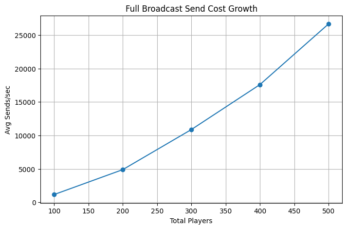
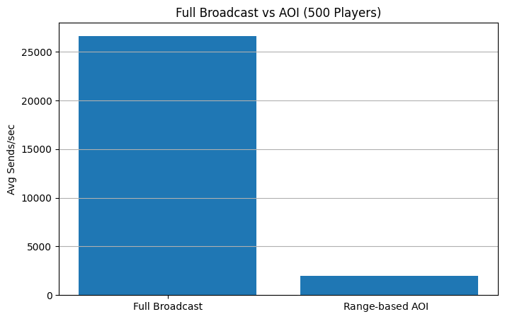
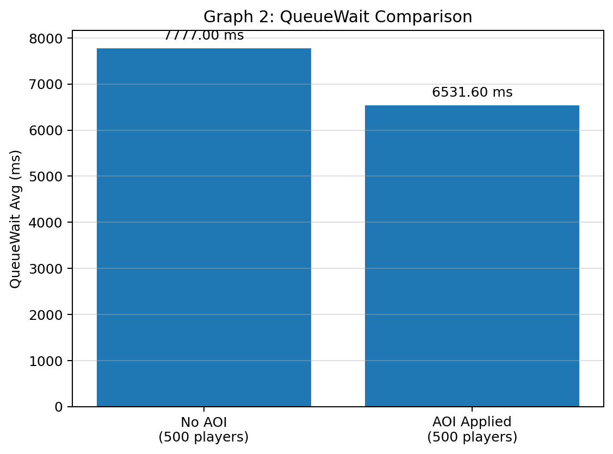

# Scenario 2 — AOI Broadcast 최적화
## Intro

100~500명의 플레이어가 이동 패킷을 전송할 때 발생하는
Broadcast Fan-out 비용과 네트워크 전송 병목을 측정하고,

Range-based AOI(Interest Management)를 적용해  
전송 비용을 감소시킨 시나리오입니다.

---

# Goal

플레이어 수 증가에 따른 Broadcast Cost 변화를 측정해
Full Broadcast 구조의 Scalability 문제를 확인했습니다.

또한 500명 기준으로 Full Broadcast와 AOI 적용 구조를 비교하여,
Broadcast Fan-out 감소가 QueueWait과 RTT에 어떤 영향을 주는지 확인했습니다.

---

# Test Environment

| Category            | Value                                |
| ------------------- | ------------------------------------ |
| Runtime             | .NET 10                              |
| Protocol            | TCP                                  |
| Serialization       | Protobuf                             |
| Client              | DummyClient                          |
| RTT Metric          | Client request → response round-trip |
| Movement Players    | 100, 200, 300, 400, 500 Players      |
| Comparison Baseline | 500 Players                          |
| Avg Sends/sec       | 초당 평균 패킷 전송 횟수                       |

---

# Movement Broadcast Flow

## Broadcast Range Evolution


Full Broadcast에서는 이동 패킷이 Room 전체 플레이어에게 전파된다.  
  
Range-based AOI 적용 이후에는,  
관심 영역(AOI) 내 플레이어에게만 이동 패킷을 전송하도록 변경했다.  

---

# Problem

멀티플레이 환경에서 플레이어 이동은 매우 빈번하게 발생한다.  
  
하지만 이동 패킷을 Room 전체에 Broadcast할 경우,  
실제로는 서로 멀리 떨어져 있어 렌더링 되지 않은 플레이어에게도  
이동 정보가 계속 전송된다.  
  
플레이어 수가 증가할수록  
이러한 불필요한 패킷 전송 비용이 누적되며,  
Broadcast Fan-out과 네트워크 송신량이 급격하게 증가했다.
따라서 전체 서버 처리 흐름에도 많은 영향을 준다.

---

# Step 1 — Full Broadcast

## Structure

모든 이동 패킷을 Room 내부 [모든 플레이어에게 Broadcast](https://github.com/junsugi/ServerSkills/blob/0cfc15943585ebdd110e6ca091952e6c73dfca44/Server/Game/Room/GameRoom.cs#L41-L47)했다.

```csharp
public void Broadcast(IMessage packet, Player? exceptPlayer)
{
    foreach (Player player in _players.Values)
    {
	    if (player == exceptPlayer)  // 자기 자신은 제외
		    continue;
        player.Session.Send(packet);
    }
}
```

플레이어의 위치와 관계없이,  
모든 이동 정보가 Room 전체에 전파되도록 구성했다.

---

## Metrics

| Total Players | Avg Requests/sec | Avg Sends/sec | Avg Recipients |
| ------------- | ---------------: | ------------: | -------------: |
| 100           |            48.84 |       1171.33 |          23.98 |
| 200           |            99.79 |       4889.62 |          49.00 |
| 300           |           146.96 |      10874.99 |          74.00 |
| 400           |           177.87 |      17596.12 |          98.67 |
| 500           |           215.07 |      26651.49 |         120.99 |

Full Broadcast는 전체 서버가 아니라 **각 GameRoom 내부 플레이어를 대상으로 수행**되며,<br/>
500명 테스트에서는 Room Sharding 이후 Room당 약 125명 기준으로 Broadcast가 발생한다.





## Observation

플레이어 수가 증가할수록 `Avg Sends/sec`가 빠르게 증가하는 현상을 확인할 수 있었다.

100명 기준 `Avg Sends/sec`는 약 1,171회였지만,
500명 기준에서는 약 26,651회까지 증가하였다.

또한 `Avg Recipients` 역시 플레이어 수 증가에 따라 함께 증가하면서,
하나의 이동 요청이 더 많은 수신자에게 전파되는 구조적 특성이 확인되었다.

## Interpretation

Full Broadcast 구조에서는 이동 패킷을 Room 전체 플레이어에게 전파하기 때문에,
플레이어 수가 증가할수록 하나의 이동 요청이 생성하는 Send 비용도 함께 증가한다.

**즉, 이동 요청 수 증가와 수신자 수 증가가 동시에 발생하면서**
**Broadcast Fan-out 비용이 빠르게 누적된다.**

이 구조에서는 실제로 관심 없는 플레이어에게도 이동 패킷이 전송되므로,
네트워크 송신량과 Queue 처리 부담이 함께 증가할 수 있다.

## Result

Full Broadcast 구조는 구현이 단순하고 상태 동기화가 쉽다는 장점이 있었지만,
플레이어 수 증가에 따라 Broadcast Fan-out 비용이 크게 증가하였다.

그 결과 불필요한 네트워크 송신량이 누적되며,
다른 게임 패킷 처리 지연에도 영향을 줄 수 있음을 확인하였다.


---

# Step 2 — Range-based AOI

## Structure

이동 패킷을 Room 전체에 Broadcast하지 않고,
플레이어 간 거리 기준으로 관심 영역(AOI)을 계산하여
[AOI 범위 내 플레이어에게만 전송](https://github.com/junsugi/ServerSkills/blob/0cfc15943585ebdd110e6ca091952e6c73dfca44/Server/Game/Room/GameRoom.cs#L52-L76)하도록 변경하였다.

AOI 범위 밖의 플레이어에게는 이동 패킷을 전송하지 않도록 하여,
불필요한 Broadcast Fan-out을 줄이는 것을 목표로 했다.

```csharp
private const float AoiRange = 3f;  // 예시

private bool IsInAoi(Player center, Player target)
{
    float dx = Math.Abs(center.Position.X - target.Position.X);
    float dy = Math.Abs(center.Position.Y - target.Position.Y);

    return dx <= AoiRange && dy <= AoiRange;
}

public void BroadcastAoi(IMessage packet, Player centerPlayer)
{
    foreach (Player player in _players.Values)
    {
    	if (player == centerPlayer)   
			continue;
			
        if (!IsInAoi(centerPlayer, player))
            continue;
			
		player.Session.Send(packet);
    }
}
```


---

## Metrics

| Room   | Avg Requests/sec | Avg Sends/sec | Avg Recipients |
| ------ | ---------------: | ------------: | -------------: |
| Room 0 |           204.28 |        458.80 |           2.14 |
| Room 1 |           203.76 |        460.43 |           2.12 |
| Room 2 |           204.46 |        489.89 |           2.22 |
| Room 3 |           203.48 |        546.58 |           2.45 |







## Observation

Send/sec는 요청 유입량의 영향을 함께 받기 때문에,
구조적 Broadcast Fan-out 감소는 Avg Recipients를 중심으로 비교했다.

Full Broadcast는 500명 기준 하나의 이동 요청이 평균 약 120.99명의 수신자에게 전파되었다.
반면 Range-based AOI 적용 후에는 Room별 Avg Recipients가 약 2.12~2.45명 수준으로 감소하였다.

이를 통해 AOI 적용 이후 하나의 이동 요청이 생성하는 평균 전송 대상 수가 크게 줄어들었으며,
불필요한 Broadcast Fan-out 비용이 감소했음을 확인할 수 있었다.

보조 지표로 보면,
500명 기준 `Avg Sends/sec` 는 Full Broadcast의 약 26,651회에서
AOI 적용 후 전체 Room 합산 약 1,956회 수준으로 감소하였다.

QueueWait은 7777.00ms에서 6531.60ms로 감소했으며,
Avg RTT 역시 7778.00ms에서 6533.31ms로 감소하였다.
다만 RTT 감소 폭은 Send/sec 감소 폭만큼 크지 않았는데,
이는 RTT가 Broadcast 비용뿐 아니라 Queue Serialization, Job Scheduling, Flush 주기 등의 
영향을 함께 받기 때문이다.

## Interpretation

AOI 적용 이후에는 이동 패킷이 전체 Room으로 전파되지 않고,
관심 영역 내 플레이어에게만 전송되었다.

그 결과 하나의 이동 요청이 생성하는 평균 수신자 수가 크게 줄어들었고,
Broadcast Fan-out 비용 또한 함께 감소하였다.

즉, 플레이어 수가 많더라도 실제 관심 영역 내 대상에게만 정보를 전송함으로써
불필요한 네트워크 송신량을 줄일 수 있었다.

## Result

Range-based AOI 적용 이후,
Broadcast Send/sec와 Avg Recipients가 크게 감소하였다.

이를 통해 Interest Management가
이동 동기화에서 발생하는 불필요한 네트워크 전송 비용을 줄이는 데 효과적임을 확인하였다.


---

# Comparison

| Structure       | Broadcast Target | Cost Characteristic | Result      |
| --------------- | ---------------- | ------------------- | ----------- |
| Full Broadcast  | Room 전체          | Fan-out 증가          | Send/sec 급증 |
| Range-based AOI | AOI 범위 내 플레이어    | Fan-out 감소          | Send/sec 감소 |

### Analysis

이번 비교에서는 Send/sec를 보조 지표로 사용하고,
구조적 Fan-out 감소 여부는 Avg Recipients를 중심으로 판단했다.

Full Broadcast 구조에서는 모든 플레이어의 이동 정보를 Room 전체에 전파했다.
이 방식은 구현이 단순하지만, 플레이어 수 증가에 따라 Broadcast Fan-out 비용이 빠르게 증가하였다.

Range-based AOI 적용 이후에는 관심 영역 내 플레이어에게만 이동 패킷을 전송하도록 변경하면서,
불필요한 네트워크 송신량을 크게 줄일 수 있었다.

다만 Avg RTT는 Send/sec 감소 폭만큼 크게 감소하지 않았다.
이는 RTT가 Broadcast 비용뿐 아니라 Queue Serialization, Job Scheduling, Flush 주기 등의 영향을 함께 받기 때문이다.

따라서 AOI는 네트워크 전송 비용 감소에는 효과적이지만,
RTT 최적화를 위해서는 Packet Batching, Tick 기반 Movement Aggregation, Queue 처리 구조 개선이 함께 필요하다.

---

## Final Result

Full Broadcast 구조에서는 플레이어 수 증가에 따라
Broadcast Fan-out과 Send Cost가 빠르게 증가하였다.

Range-based AOI 적용 이후에는
관심 영역 내 플레이어에게만 이동 패킷을 전송하면서
불필요한 네트워크 송신량을 크게 줄일 수 있었다.

이를 통해 MMO 서버에서 이동 동기화는
단순히 상태를 정확히 전파하는 것뿐 아니라,
실제로 관심 있는 대상에게만 전송하도록 
Interest Management 범위를 설계하는 것이 중요함을 확인하였다.

---

# Limitations

- AOI 범위를 고정값으로 사용  
- 실제 네트워크 바이트 수가 아닌 Send Count/sec 기준 측정  
- 실제 클라이언트 렌더링 거리 / 시야각 조건 미반영  
- Grid / Spatial Partitioning 없이 Room 내부 플레이어 전체 순회  
- 위치 분포가 균등한 조건에서 측정

---

# Future Work

- Grid 기반 Spatial Partitioning 적용
- AOI Grid Cache 최적화
- Tick 기반 Movement Aggregation
- Packet Batching 적용
- Cell 기반 Interest Management 실험
